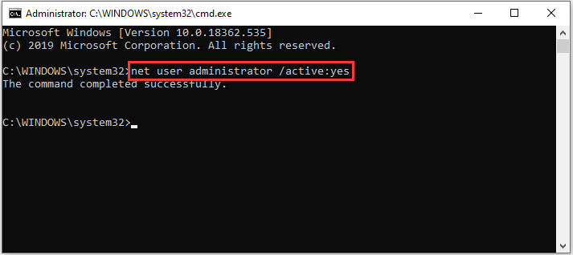
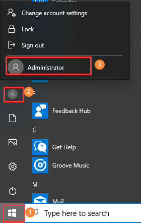

# How to Enable Administrator Account (Built-in) on Windows 10

_Clipped from: https://www.partitionwizard.com/partitionmanager/enable-administrator-account.html_

## Method 1: Enable Admin Account in Command Prompt

Using Command Prompt is the simplest and widely-used method to activate administrator account.

**Step 1**: Type `cmd` in the Search bar.

**Step 2**: Right-click `Command Prompt` from the search results and select `Run as administrator`.

**Step 3**: Now type the command `net user administrator /active:yes` and press <kbd>Enter</kbd> to enable the built-in administrator account.

Once it’s done, you can click the `Start` button and click your `user account name`. In the pop-up list, the hidden administrator account will be displayed. You can access this account simply by clicking it.

**Note:** To disable the built-in administrator account in Command Prompt, type `net user administrator /active:no` and press <kbd>Enter</kbd>.
